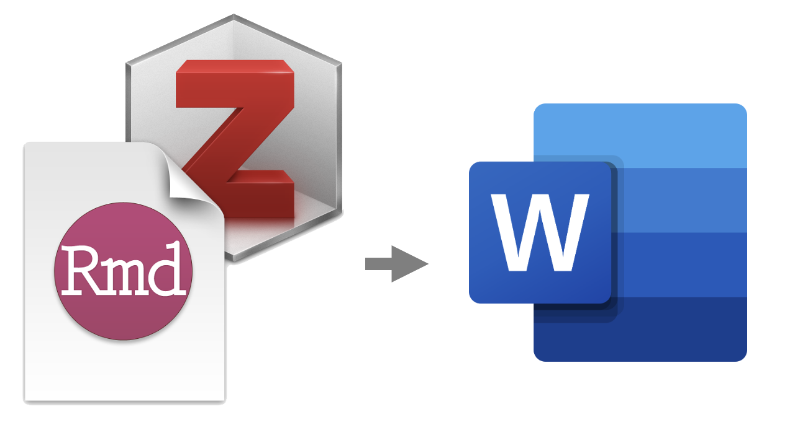

<p align="center">
  
</p>

**This repository is an operationalisation of the workflow described in https://gsverhoeven.github.io/post/zotero-rmarkdown-csl/**

<!-- TOC start (generated with https://github.com/derlin/bitdowntoc) -->

- [📍 Target Audience](#-target-audience)
- [🤔 Why this workflow ](#-why-this-workflow)
- [💻 How to use this](#-how-to-use-this)
- [🥥 Supplementary features from G. Verhoeven workflow :](#-supplementary-features-from-g-verhoeven-workflow-)
- [🖋 License](#-license)

<!-- TOC end -->

# 📍 Target Audience

As said in the previous link, this workflow allows to ...

> set up a reproducible workflow for scientific writing with a focus on getting the journal citation hell right. It boils down to writing the manuscript in Rmarkdown, and using a set of auxiliary tools to manage citations and output to Word to share with collaborators and to prepare the final document for submission to the journal.

You are : 
- [ ] a *researcher* or a *student*
- [ ] writing *papers* or a *thesis* (= something with plots, or statistics, or references)
- [ ] using *R* for showing descriptive statistics, creating plots, etc.
- [ ] using *Zotero* for integrating references in your work
- [ ] working with people reading your work in a *word* document

# 🤔 Why this workflow 

The issues I have been dealing with on my first research paper that I want to avoid :

- Copy-Paste from Zotero each and every APA reference in the Reference section on word (omg...)
- Check if all my references are present in the Reference section and vice-versa
- When your PI asks : "Do you remember the version where we used to do THIS analysis ?" – that's why I integrated a way to enter a subtitle before rendering to at least have a slight idea of what has been done on the current version
- Loosing time on InkScape and Word to get the right position / legend on the doc (ughh...)

# 💻 How to use this

- In your desired folder/directory, unzip/git clone (see below) this repository :

```
git clone git@github.com:kennethrioja/rmdzoteroword_workflow.git
```

- Once the repository is downloaded follow the steps from https://gsverhoeven.github.io/post/zotero-rmarkdown-csl/ (see below the changes to be done to work with this repo) :
	- 1 – choose target journal,
	- 2 – install zotero : I am adding an additionnal step, under "File" > "Import...", choose the file `rmdtoword_workflow.json` in the `./assets/utils` folder of the recently downloaded repository, this will import a small folder on Zotero which will be used to make the example work, see below
	- 3 – install zotero connector and know how to save citations from your browser,
	- 4 – citation keys : my personnal “Citation Key Format” is :
 
		```
		[auth.etal:lower:replace=.,_:postfix=_][>0][year]|[veryshorttitle][year]
		```
		So that citation key is :
		- 1 author : `@author1_yyyy`
		- 2 authors : `@author1_author2_yyyy`
		- 3+ authors : `@author1_etal_yyyy`

	- 5 – install RStudio
	- 6 – connect Zotero to RStudio
	- 7 – create the bibliography : this is already in `mypaper.Rmd`
	- 8 – proper citation format : download the one you need, move the .csl file in , move the .csl file in `./assets/utils` and change its name by `citation_style.csl` (by default it is APA 7th) OR change the `csl` path in `mypaper.Rmd`
	- 9 – word output : like before, copy-paste inside `./assets/utils` a word doc with the proper styling, either rename it to `doc_style.docx` or change `reference_docx` path in `mypaper.Rmd`

- Change `mypaper.Rmd` to `choosewhatyouwant.Rmd` -> this will be the name of the word doc too 

- Pheew... you should be ready to go, to test it :
	- If you are on MacOS, in the downloaded repository on Finder, you can double click on the `render.command` file. A window should pop asking you a subtitle, then the word document should be opened automatically (if this does not work, please contact me)
	- If you are not on Mac, open a terminal, go to the downloaded repository and run `./render.command`. It should behave the same as I previously mentionned for MacOS.

- You now have under the `output` folder a word document `theRmdname_yyyymmdd.docx` (yyyymmdd being the current date) with your desired tables, plots, citations, citation style, references, styling – now it is your turn to do the magic !

- Thanks and feel free to contact me to improve the workflow !

# 🥥 Supplementary features from G. Verhoeven workflow :
- [x] added a bash script to
	1. add a subtitle to the output document – this is useful for me to be able to navigate through the thousands of versions created);
	2. change the location and name of the output document – instead of knitting and having N versions in the current working directory
- [ ] add a copy-paste mini-bash script in github to (*avoid the installation process*) setup the whole environment, e.g., finding the right csl, giving a name to the .Rmd and .docx

# 🖋 License

<a rel="license" href="http://creativecommons.org/licenses/by-nc-sa/4.0/"></a><br />This work is licensed under a <a rel="license" href="http://creativecommons.org/licenses/by-nc-sa/4.0/">Creative Commons Attribution-NonCommercial-ShareAlike 4.0 International License</a>.
